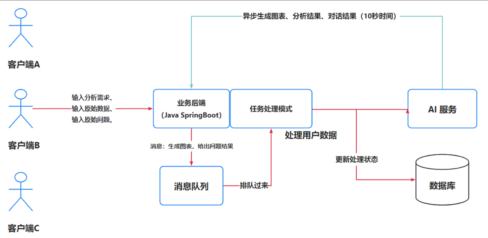
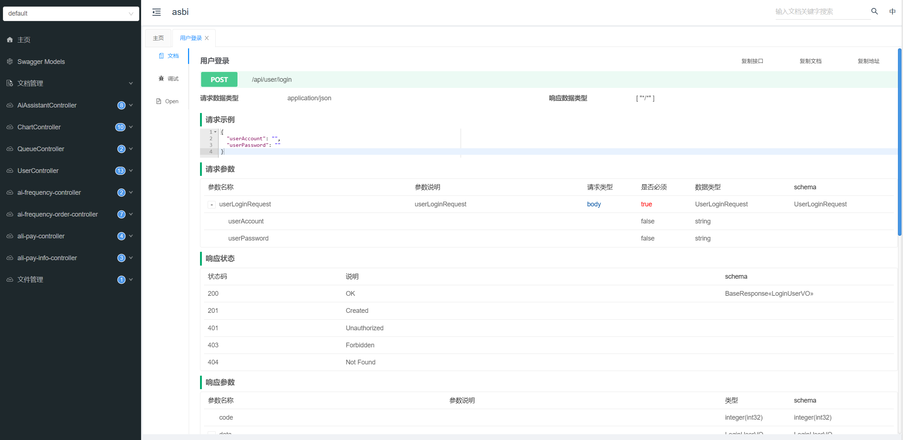

# asbi 智能bi平台
## 项目介绍
本项目是基于AIGC的智能BI数据分析平台

区别于传统的BI，数据分析者只需要导入最原始的数据集，输入想要进行分析的目标，就能利用AI自动生成一个符合要求的图表以及分析结论。此外，还会有图表管理、异步生成、AI对话等功能。只需输入分析目标、原始数据和原始问题，利用AI就能一键生成可视化图表、分析结论和问题解答，大幅降低人工数据分析成本。

优势： 让不会数据分析的用户也可以通过输入目标快速完成数据分析，大幅节约人力成本，将会用到 AI 接口生成分析结果

## 项目架构图

## swagger3

1. 使用 Easy Excel 解析上传的XLSX文件并压缩为CSV文件，实测提高了20%的单次输入数据量，缩短了Token
2. 利用令牌桶限流算法与Redisson实现简单且高效分布式限流
3. 利用消息队列完成异步生成图表

cloud版本：https://github.com/AgSword/asbi_cloud